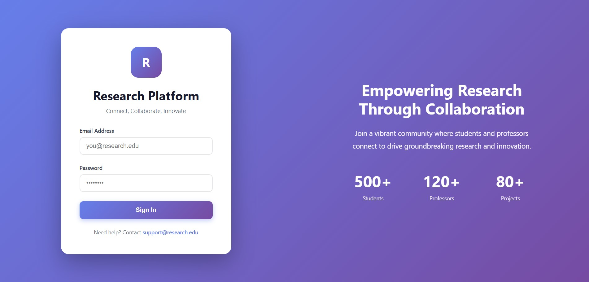
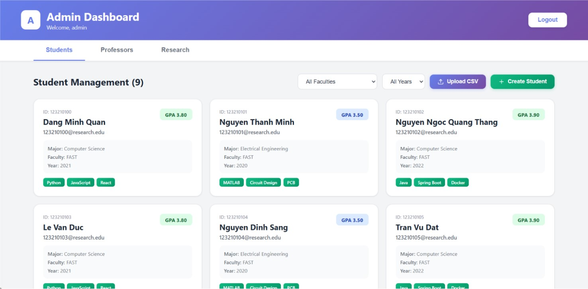
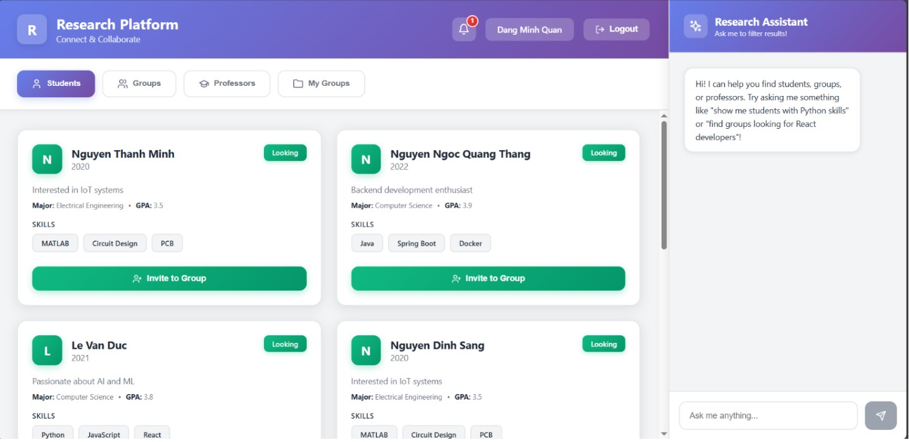
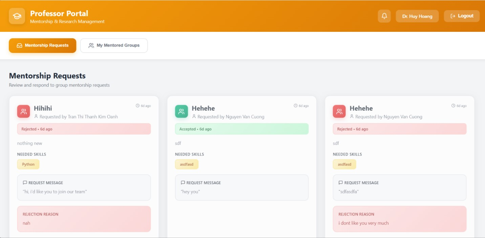

# SPARK-v1 - Smart Pathway Advisor with Reasoning and Knowledge

[](https://www.python.org/)
[](https://fastapi.tiangolo.com/)
[](https://reactjs.org/)
[](https://www.typescriptlang.org/)
[](https://www.postgresql.org/)
---



A full-stack platform that connects students, professors, and research groups. It simplifies team formation, mentorship matching, and research collaboration through an AI-powered chat assistant and real-time notifications.

---

## 📋 Table of Contents

- [Overview](#-overview)
- [Problem Statement](#-problem-statement)
- [Features](#-features)
- [Tech Stack](#-tech-stack)
- [Installation](#-installation)
- [Usage](#-usage)


---

## 🌟 Overview

**Student Research Group Manager** is a comprehensive platform designed for academic institutions to streamline research collaboration. Students can discover peers with matching skills, form research groups, and request mentorship from professors. The system includes an intelligent chat assistant that helps users navigate the platform using natural language queries.

**Target Users:**
- Students seeking research teammates
- Professors offering mentorship
- Academic administrators managing research programs

---

## 🎯 Problem Statement

Research collaboration in universities faces several challenges:

- **Fragmented discovery**: Students struggle to find peers with complementary skills
- **Manual coordination**: Group formation and mentorship requests happen through scattered emails
- **Limited visibility**: Professors can't efficiently track or manage mentorship capacity
- **No centralized communication**: Research groups lack dedicated collaboration tools

This platform solves these problems with a unified system that automates discovery, streamlines requests, and enables real-time collaboration.

---

## ✨ Features

### 👨‍🎓 For Students

- **Smart Search**: Find students by skills, major, GPA, or availability using AI chat assistant
- **Group Management**: Create research groups, invite members, and manage join requests
- **Mentorship Requests**: Browse professors and send personalized mentorship requests (up to 2 active requests)
- **Real-time Chat**: Built-in group messaging with read receipts and message history
- **Notifications**: Instant alerts for invitations, join requests, and mentorship responses
- **Profile Management**: Update bio, skills, and availability status

### 👨‍🏫 For Professors

- **Mentorship Dashboard**: Review and respond to mentorship requests with acceptance/rejection reasons
- **Capacity Management**: Set and track available mentorship slots automatically
- **Group Monitoring**: View all mentored groups and their members
- **Advanced Filtering**: Search by faculty, research area, or availability

### 🔧 For Administrators

- **Bulk Operations**: Import students and professors via CSV upload
- **Data Management**: Full CRUD operations for students, professors, and research papers
- **Analytics Dashboard**: Track system-wide statistics and activity

### 🤖 AI-Powered Features

- **Natural Language Interface**: Chat assistant understands queries like "show me CS students with Python skills"
- **Smart Recommendations**: Context-aware suggestions for group matches
- **Auto-filtering**: Dynamically filters results based on conversation context

---

**Key Components:**

- **API Layer**: RESTful endpoints with automatic OpenAPI documentation
- **Authentication**: JWT-based auth with role-based access control (Student, Professor, Admin)
- **Database**: Normalized schema with proper foreign keys and indexes
- **Migrations**: Alembic for version-controlled database changes
- **Real-time Features**: WebSocket-ready architecture for chat and notifications

---

## 🛠️ Tech Stack

### Backend
- **Framework**: FastAPI (high-performance async API)
- **ORM**: SQLAlchemy (database abstraction)
- **Migrations**: Alembic (version control for schema changes)
- **Authentication**: JWT tokens with bcrypt password hashing
- **Database**: PostgreSQL 15+ (ACID-compliant relational DB)

### Frontend
- **Framework**: React 18+ with TypeScript
- **State Management**: React Hooks (useState, useEffect, useContext)
- **HTTP Client**: Axios with interceptors for auth
- **Routing**: React Router v6
- **Styling**: Inline CSS-in-JS
- **Icons**: Lucide React

---

## 📦 Installation

### Prerequisites

- Python 3.9+
- Node.js 16+
- PostgreSQL 15+

### Backend Setup

```bash
cd backend

# Create virtual environment
python -m venv venv
source venv/bin/activate

# Install dependencies
pip install -r requirements.txt

# Configure database
# Edit alembic.ini and set your PostgreSQL connection string:

# Run migrations
alembic upgrade head

# Start server
uvicorn app.main:app --reload --host 0.0.0.0 --port 8000
```

**API will be available at**: `http://localhost:8000`  
**Swagger docs**: `http://localhost:8000/docs`

### Frontend Setup

```bash
cd frontend

npm install

# Create .env file:
VITE_API_BASE_URL=http://localhost:8000/api/v1

npm run dev
```

**App will be available at**: `http://localhost:5173`

---

## 🚀 Usage

### 1. Admin Setup (First Time)

- Access admin dashboard at `/admin`
- Create initial student and professor accounts
- Bulk import users via CSV (optional)



### 2. Student Workflow

```
1. Register/Login → 2. Complete Profile → 3. Browse Students/Groups
                                          ↓
                            4. Create/Join Group ← 5. Chat with Assistant
                                          ↓
                            6. Request Mentorship → 7. Collaborate
```

**Example Chat Commands:**
- "Show me CS students with Python skills"
- "Find groups looking for React developers"
- "List professors in the Engineering department"



### 3. Professor Workflow

```
1. Login → 2. Set Available Slots → 3. Review Mentorship Requests
                                     ↓
                    4. Accept/Reject → 5. Mentor Groups
```


